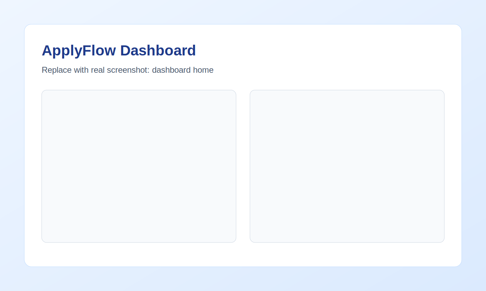
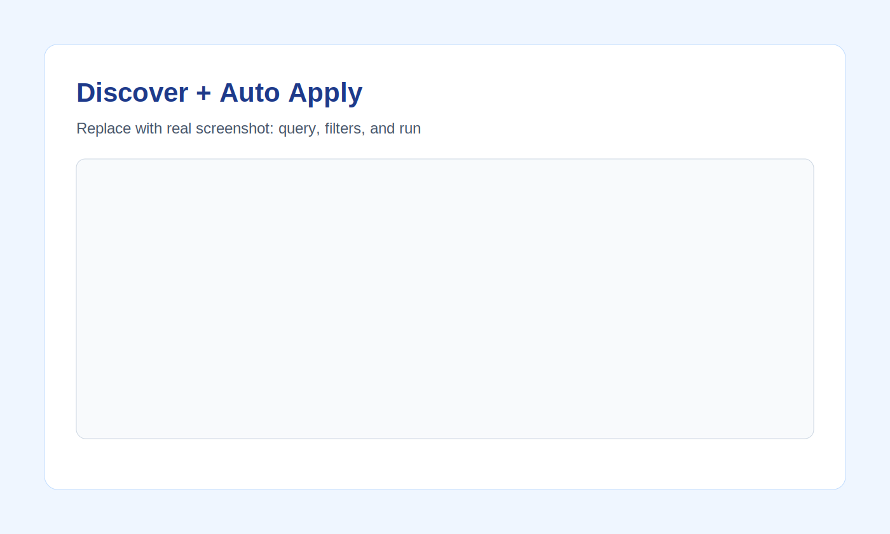
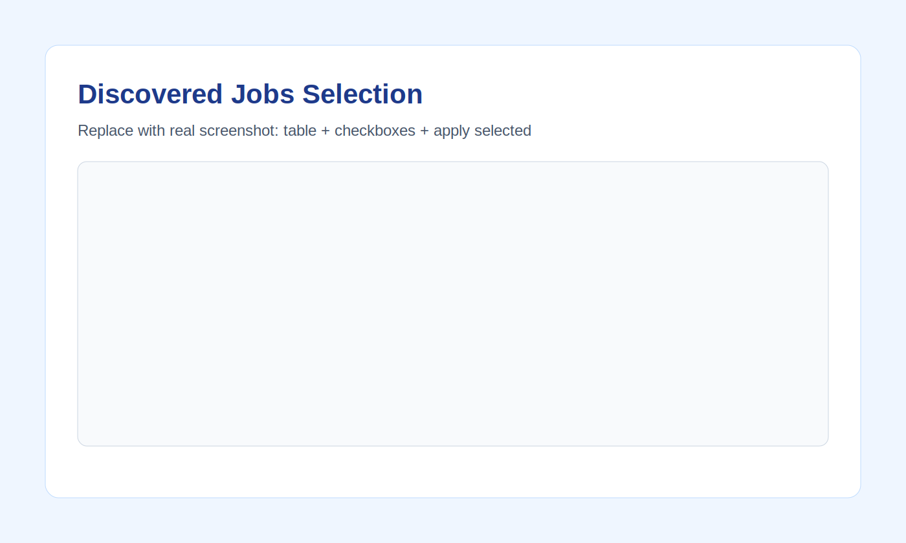
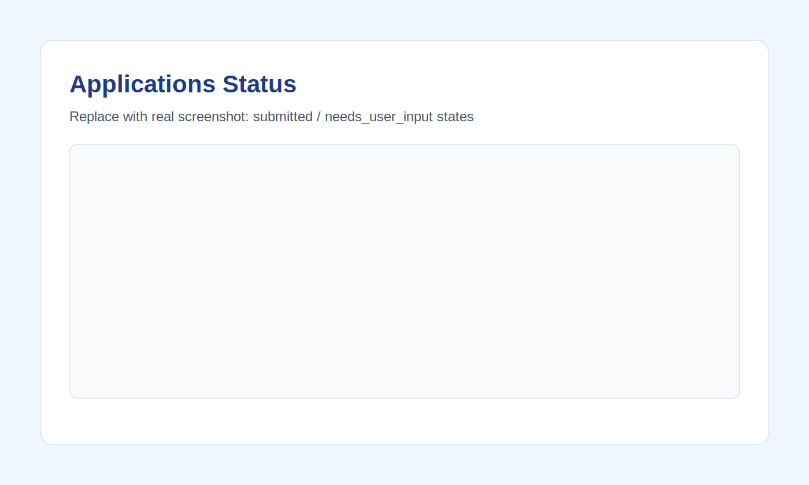

# Job Finder: AI-Powered Job Discovery and Auto-Apply Assistant

A local web application that discovers jobs from multiple internet sources, evaluates fit against resume/profile data, and automates application workflows with human-in-the-loop checkpoints.

## Why This Project Matters

This project demonstrates practical skills for **Business Analyst**, **Data Scientist**, and **AI/ML Engineer** roles:

- Business process automation and workflow design
- Multi-source data ingestion and normalization
- AI-assisted decision scoring (job-fit assessment)
- Human-in-the-loop exception handling
- API-first backend architecture and dashboard UX

## Role-Relevant Capabilities

### Business Analyst Alignment
- Designed configurable filtering logic for job domain, title, location, and education criteria
- Built traceable status pipeline (`submitted`, `needs_user_input`, `failed`) for operational visibility
- Added dashboard controls for batch execution and exception management

### Data Scientist / AI Alignment
- Structured resume/job data into comparable features for scoring
- Implemented model-backed qualification scoring with fallback heuristics
- Enabled ranking and threshold-based decisioning for high-volume screening

### Applied AI / Engineering Alignment
- FastAPI service architecture with typed models and modular providers
- Multi-provider discovery pipeline (`public`, `linkedin_web`, `indeed_web`, `google_web`, optional `jsearch`)
- Playwright adapter framework for browser-driven apply flows

## Key Features

- Multi-source internet job discovery
- Resume parsing and profile preference matching
- AI qualification scoring
- Auto-apply at scale with score thresholds and caps
- Specific-job bulk apply mode
- Human escalation when automation encounters required manual fields
- Local, single-user dashboard with no sign-in requirement

## Tech Stack

- Python, FastAPI, Pydantic
- Playwright (browser automation)
- HTTPX + BeautifulSoup (web source ingestion)
- OpenAI API (optional scoring enhancement)
- Vanilla HTML/CSS/JS dashboard

## Quick Start

```bash
cd backend
python3 -m venv .venv
source .venv/bin/activate
pip install -r requirements.txt
playwright install chromium
uvicorn app.main:app --reload
```

Open:
- Dashboard: `http://127.0.0.1:8000/`
- API docs: `http://127.0.0.1:8000/docs`

## Demo Flow (60 Seconds)

1. Save profile and paste resume.
2. Run Discover + Auto Apply with role/domain filters.
3. Review discovered jobs and select specific jobs.
4. Run Apply Selected and inspect status transitions.
5. Show `needs_user_input` handling for manual-required fields.

## Screenshots

Add images to `docs/images/` with these names:

- `dashboard-home.svg` (or `.png`)
- `discover-auto-apply.svg` (or `.png`)
- `discovered-jobs-selection.svg` (or `.png`)
- `applications-status.svg` (or `.png`)

Then they render automatically below:






## Internet Search Configuration

Default mode (no key required):

```bash
export JOB_PROVIDER=public
```

Multi-source discovery in dashboard is controlled with `search_sources`, defaulting to:

```text
public, linkedin_web, indeed_web, google_web
```

Optional broader API source:

```bash
export JOB_PROVIDER=jsearch
export RAPIDAPI_KEY=your_key
export RAPIDAPI_HOST=jsearch.p.rapidapi.com
```

Optional AI scoring enhancement:

```bash
export OPENAI_API_KEY=your_key
export OPENAI_MODEL=gpt-4o-mini
```

## Recruiter Docs

- [Technical Architecture](docs/architecture.md)
- [Recruiter Brief](docs/recruiter-brief.md)
- [Resume Bullet Bank](docs/resume-bullets.md)
- [GitHub Profile Optimization](docs/github-optimization.md)
- [Release Checklist](docs/release-checklist.md)

## License

MIT - see [LICENSE](LICENSE)
